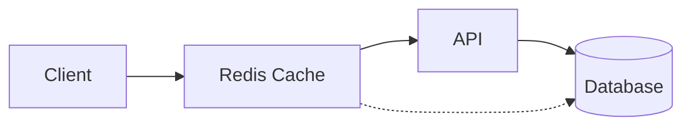
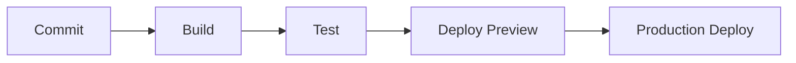

# Gradiant Architecture

## System Overview

Gradiant is built on a modern, secure, and scalable architecture that combines the best practices from various platforms while maintaining strong privacy and security measures through Zero-Knowledge Encryption and HIPAA compliance.

<Frame>
  ```mermaid
  graph TB
    subgraph Frontend
      UI[UI Components]
      State[State Management]
      ZKClient[ZK Client]
    end

    subgraph Backend
      API[API Layer]
      Auth[Authentication]
      ZKServer[ZK Server]
      Queue[Message Queue]
    end

    subgraph Database
      Supabase[(Supabase)]
      Cache[(Redis Cache)]
    end

    UI --> State
    State --> ZKClient
    ZKClient --> API
    API --> Auth
    API --> ZKServer
    Auth --> Supabase
    ZKServer --> Queue
    Queue --> Supabase
    API --> Cache
  ```
</Frame>

## Core Components

### Frontend Architecture

<Tabs>
  <Tab title="UI Layer">
    The UI layer is built using React and Next.js, incorporating design elements from Liftoff's interview platform:

    - **Component Structure**
      - Atomic Design Principles
      - Shared Component Library
      - Theme Provider (Dark/Light modes)
      - Responsive Layout System

    - **State Management**
      - React Context for global state
      - React Query for server state
      - Local storage for persistence
      - Secure credential handling
  </Tab>

  <Tab title="Data Flow">
    Data flow follows unidirectional principles:

    1. User actions trigger state changes
    2. State updates propagate to components
    3. Side effects handled by middleware
    4. Server state synchronized via WebSocket
  </Tab>
</Tabs>

### Backend Architecture

<Cards>
  <Card title="API Layer">
    - RESTful endpoints
    - GraphQL interface
    - WebSocket connections
    - Rate limiting
    - Request validation
  </Card>
  <Card title="Authentication">
    - Supabase Auth integration
    - JWT token management
    - Role-based access control
    - Session handling
  </Card>
  <Card title="Zero-Knowledge System">
    - End-to-end encryption
    - Client-side key generation
    - Secure message passing
    - Zero-knowledge proofs
  </Card>
</Cards>

## Database Design

### Supabase Schema

```sql
-- Core Tables
CREATE TABLE users (
  id UUID PRIMARY KEY DEFAULT uuid_generate_v4(),
  email TEXT UNIQUE NOT NULL,
  encrypted_data JSONB,
  settings JSONB DEFAULT '{}'::jsonb,
  created_at TIMESTAMPTZ DEFAULT NOW(),
  updated_at TIMESTAMPTZ DEFAULT NOW()
);

CREATE TABLE sessions (
  id UUID PRIMARY KEY DEFAULT uuid_generate_v4(),
  user_id UUID REFERENCES users(id),
  metadata JSONB,
  started_at TIMESTAMPTZ DEFAULT NOW(),
  ended_at TIMESTAMPTZ
);

CREATE TABLE messages (
  id UUID PRIMARY KEY DEFAULT uuid_generate_v4(),
  session_id UUID REFERENCES sessions(id),
  encrypted_content TEXT NOT NULL,
  metadata JSONB,
  created_at TIMESTAMPTZ DEFAULT NOW()
);
```

## Security Architecture

<Steps>
  ### 1. Authentication Flow
  - User registration/login via Supabase Auth
  - JWT token generation and validation
  - Secure session management

  ### 2. Zero-Knowledge Implementation
  - Client-side key generation
  - End-to-end encryption of sensitive data
  - Zero-knowledge proof verification

  ### 3. Data Protection
  - Encrypted data storage in Supabase
  - Secure key management
  - Regular security audits
</Steps>

## Integration Points

### Liftoff Features

<AccordionGroup>
  <Accordion title="UI Components">
    - Chat interface adaptation
    - Dashboard layouts
    - Form components
    - Navigation elements
  </Accordion>
  
  <Accordion title="State Management">
    - Real-time updates
    - Cache management
    - Optimistic updates
    - Error handling
  </Accordion>
</AccordionGroup>

### PocketBase Inspired Features

<AccordionGroup>
  <Accordion title="Authentication System">
    - Adapted for Supabase
    - Enhanced with ZK principles
    - Role-based access control
  </Accordion>
  
  <Accordion title="API Structure">
    - RESTful endpoints
    - Real-time subscriptions
    - Request validation
  </Accordion>
</AccordionGroup>

## Performance Considerations

### Caching Strategy



- **Client-side caching**
  - React Query cache
  - Service Worker cache
  - Local storage cache

- **Server-side caching**
  - Redis cache layer
  - Database query cache
  - CDN caching

### Optimization Techniques

<Cards>
  <Card title="Frontend Optimization">
    - Code splitting
    - Lazy loading
    - Image optimization
    - Bundle size reduction
  </Card>
  <Card title="Backend Optimization">
    - Query optimization
    - Connection pooling
    - Background job processing
    - Resource scaling
  </Card>
</Cards>

## Deployment Architecture

<Frame>
  ```mermaid
  graph TB
    subgraph Production
      LB[Load Balancer]
      App1[App Server 1]
      App2[App Server 2]
      Cache[(Redis)]
      DB[(Supabase)]
    end

    Client --> LB
    LB --> App1
    LB --> App2
    App1 --> Cache
    App2 --> Cache
    App1 --> DB
    App2 --> DB
  ```
</Frame>

### Infrastructure Components

- **Frontend**
  - Vercel deployment
  - Edge functions
  - CDN distribution

- **Backend**
  - Containerized services
  - Auto-scaling groups
  - Load balancing

- **Database**
  - Supabase managed instance
  - Read replicas
  - Backup strategy

## Monitoring & Logging

### Observability Stack

- **Application Monitoring**
  - Error tracking
  - Performance metrics
  - User analytics

- **Infrastructure Monitoring**
  - Server metrics
  - Database metrics
  - Cache performance

- **Security Monitoring**
  - Audit logs
  - Access logs
  - Security alerts

## Development Workflow

### Local Development

```bash
# Frontend development
pnpm dev

# Backend development
pnpm backend:dev

# Database migrations
pnpm db:migrate

# Testing
pnpm test
```

### CI/CD Pipeline



<Note>
  This architecture documentation is maintained alongside the codebase and updated as the system evolves. For implementation details of specific components, refer to the respective documentation sections.
</Note> 