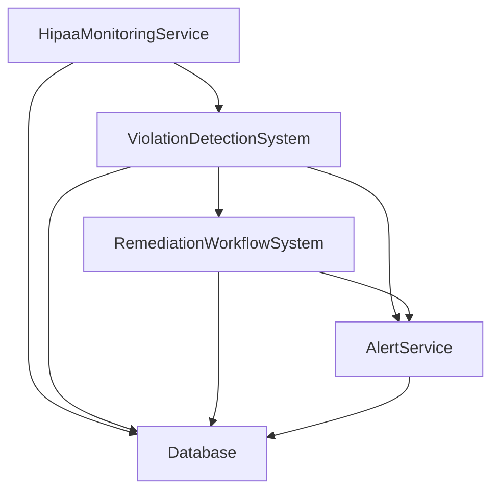
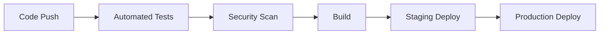

# HIPAA Compliance Technical Architecture

## System Architecture

### Core Components



### 1. HipaaMonitoringService

```typescript
interface MonitoringEvent {
  type: 'access' | 'authentication' | 'encryption' | 'data_access';
  timestamp: string;
  user_id?: string;
  data_type?: string;
  authorized?: boolean;
  encrypted?: boolean;
  record_id?: string;
}

class HipaaMonitoringService {
  static async startMonitoring(): Promise<Subscription>;
  static async processEvent(event: MonitoringEvent): Promise<void>;
  static async checkSystemHealth(): Promise<HealthStatus>;
}
```

### 2. ViolationDetectionSystem

```typescript
interface Violation {
  id: string;
  type: 'unauthorized_access' | 'phi_exposure' | 'encryption_failure';
  severity: 'low' | 'medium' | 'high' | 'critical';
  description: string;
  metadata: Record<string, any>;
  status: 'new' | 'in_progress' | 'resolved';
}

class ViolationDetectionSystem {
  static async processEvent(event: MonitoringEvent): Promise<Violation[]>;
  static async evaluateSeverity(violation: Violation): Promise<string>;
  static async updateViolationStatus(id: string, status: string): Promise<void>;
}
```

### 3. RemediationWorkflowSystem

```typescript
interface RemediationStep {
  id: string;
  type: 'automated' | 'manual';
  description: string;
  status: 'pending' | 'in_progress' | 'completed' | 'failed';
  notes?: string;
  completedAt?: string;
}

interface RemediationWorkflow {
  id: string;
  violationId: string;
  violationType: string;
  severity: string;
  status: 'initiated' | 'in_progress' | 'completed';
  steps: RemediationStep[];
}

class RemediationWorkflowSystem {
  static async createWorkflow(violation: Violation): Promise<RemediationWorkflow>;
  static async processAutomatedSteps(workflowId: string): Promise<void>;
  static async updateManualStep(
    workflowId: string,
    stepId: string,
    status: string,
    notes?: string
  ): Promise<void>;
  static async getWorkflow(id: string): Promise<RemediationWorkflow | null>;
}
```

### 4. AlertService

```typescript
interface Alert {
  id: string;
  type: 'hipaa_violation' | 'security_breach' | 'system_error';
  severity: 'low' | 'medium' | 'high' | 'critical';
  message: string;
  metadata: Record<string, any>;
  status: 'new' | 'acknowledged' | 'resolved';
  createdAt: string;
  acknowledgedAt?: string;
  resolvedAt?: string;
}

class AlertService {
  static async createAlert(
    type: string,
    severity: string,
    message: string,
    metadata: Record<string, any>
  ): Promise<Alert>;
  static async acknowledgeAlert(id: string): Promise<void>;
  static async resolveAlert(id: string): Promise<void>;
  static async getActiveAlerts(): Promise<Alert[]>;
}
```

## Database Schema

### Tables

#### 1. hipaa_events
```sql
CREATE TABLE hipaa_events (
  id UUID PRIMARY KEY DEFAULT uuid_generate_v4(),
  type VARCHAR(50) NOT NULL,
  timestamp TIMESTAMPTZ NOT NULL,
  user_id UUID REFERENCES auth.users(id),
  data_type VARCHAR(50),
  authorized BOOLEAN,
  encrypted BOOLEAN,
  record_id UUID,
  metadata JSONB,
  created_at TIMESTAMPTZ DEFAULT NOW()
);
```

#### 2. violations
```sql
CREATE TABLE violations (
  id UUID PRIMARY KEY DEFAULT uuid_generate_v4(),
  type VARCHAR(50) NOT NULL,
  severity VARCHAR(20) NOT NULL,
  description TEXT NOT NULL,
  metadata JSONB,
  status VARCHAR(20) NOT NULL,
  created_at TIMESTAMPTZ DEFAULT NOW(),
  updated_at TIMESTAMPTZ DEFAULT NOW()
);
```

#### 3. remediation_workflows
```sql
CREATE TABLE remediation_workflows (
  id UUID PRIMARY KEY DEFAULT uuid_generate_v4(),
  violation_id UUID REFERENCES violations(id),
  violation_type VARCHAR(50) NOT NULL,
  severity VARCHAR(20) NOT NULL,
  status VARCHAR(20) NOT NULL,
  steps JSONB NOT NULL,
  created_at TIMESTAMPTZ DEFAULT NOW(),
  updated_at TIMESTAMPTZ DEFAULT NOW()
);
```

#### 4. alerts
```sql
CREATE TABLE alerts (
  id UUID PRIMARY KEY DEFAULT uuid_generate_v4(),
  type VARCHAR(50) NOT NULL,
  severity VARCHAR(20) NOT NULL,
  message TEXT NOT NULL,
  metadata JSONB,
  status VARCHAR(20) NOT NULL,
  created_at TIMESTAMPTZ DEFAULT NOW(),
  acknowledged_at TIMESTAMPTZ,
  resolved_at TIMESTAMPTZ
);
```

## Security Implementation

### 1. Encryption

- Data at rest: AES-256-GCM
- Data in transit: TLS 1.3
- Key rotation: Every 90 days
- Key storage: AWS KMS

### 2. Authentication

- Multi-factor authentication required
- JWT tokens with short expiration
- Session management with secure cookies
- Rate limiting on authentication endpoints

### 3. Authorization

- Role-based access control (RBAC)
- Principle of least privilege
- Regular access reviews
- Audit logging of all access attempts

## Monitoring and Logging

### 1. System Monitoring

- Real-time event processing
- Health checks every 5 minutes
- Performance metrics collection
- Resource utilization tracking

### 2. Audit Logging

- All PHI access logged
- Authentication attempts recorded
- System configuration changes tracked
- Encryption operations documented

## Testing Strategy

### 1. Unit Tests

- Component-level testing
- Mocked external dependencies
- Coverage requirements: 90%+
- Automated test runs on CI/CD

### 2. Integration Tests

- Component interaction testing
- Database integration testing
- External service integration
- Error handling verification

### 3. End-to-End Tests

- Complete workflow testing
- Real-world scenario simulation
- Performance testing
- Security testing

## Deployment Architecture

### 1. Infrastructure

- Cloud provider: AWS
- Region: us-east-1 (primary)
- Backup region: us-west-2
- Multi-AZ deployment

### 2. Services

- API Gateway
- Lambda functions
- RDS (PostgreSQL)
- ElastiCache (Redis)
- S3 (encrypted storage)
- CloudWatch (monitoring)

### 3. Security Groups

- VPC isolation
- Network ACLs
- Security group rules
- WAF configuration

## Backup and Recovery

### 1. Backup Strategy

- Database: Daily full backup
- Incremental backups every 6 hours
- Retention: 30 days
- Cross-region replication

### 2. Recovery Procedures

- Point-in-time recovery
- Cross-region failover
- Data restoration process
- Business continuity plan

## Performance Optimization

### 1. Caching Strategy

- Redis for session data
- Query result caching
- Cache invalidation rules
- Cache hit ratio monitoring

### 2. Database Optimization

- Index optimization
- Query performance tuning
- Connection pooling
- Regular maintenance

## Version Control

- GitHub repository
- Branch protection rules
- Code review requirements
- Automated testing on PR

## Deployment Process

### 1. CI/CD Pipeline



### 2. Environment Configuration

- Development
- Staging
- Production
- Disaster recovery

Last Updated: [Current Date]
Version: 1.0 