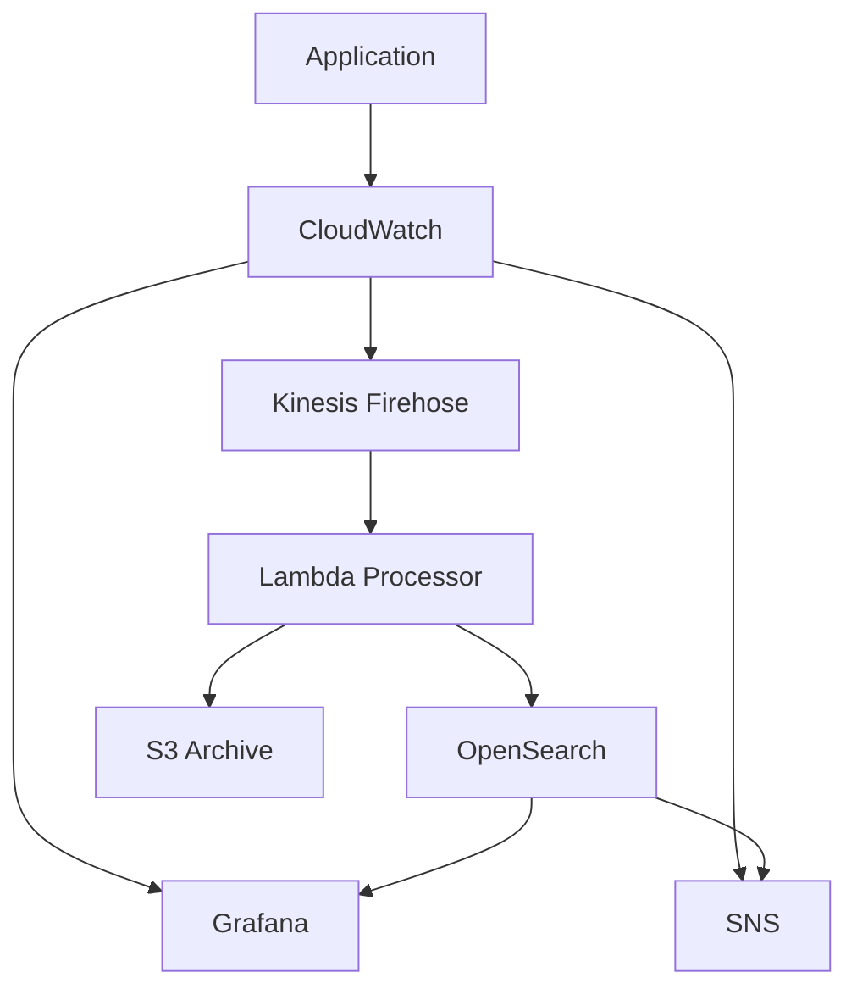

# Monitoring Guide

## Table of Contents
1. [Overview](#overview)
2. [Metrics Reference](#metrics-reference)
3. [Log Analysis](#log-analysis)
4. [Alert Configuration](#alert-configuration)
5. [Dashboard Usage](#dashboard-usage)
6. [Best Practices](#best-practices)

## Overview

Our monitoring stack consists of:
- CloudWatch for metrics and logs
- OpenSearch for log aggregation and analysis
- Grafana for visualization
- SNS for alerting

### Architecture



## Metrics Reference

### Application Metrics

1. Request Metrics
   - `request_count`: Total number of requests
   - `request_latency`: P95 response time
   - `error_rate`: Percentage of 5xx errors

2. Resource Metrics
   - `cpu_utilization`: CPU usage percentage
   - `memory_utilization`: Memory usage percentage
   - `disk_usage`: Disk space utilization

3. Business Metrics
   - `active_users`: Number of active users
   - `transaction_count`: Number of transactions
   - `conversion_rate`: User conversion rate

### Infrastructure Metrics

1. ECS Metrics
   - `running_tasks`: Number of running tasks
   - `pending_tasks`: Number of pending tasks
   - `service_cpu`: Service CPU utilization
   - `service_memory`: Service memory utilization

2. ALB Metrics
   - `healthy_hosts`: Number of healthy targets
   - `request_count`: Number of processed requests
   - `target_response_time`: Target response time
   - `error_rate`: Error rate percentage

3. Database Metrics
   - `db_connections`: Active database connections
   - `db_cpu`: Database CPU utilization
   - `read_iops`: Read operations per second
   - `write_iops`: Write operations per second

## Log Analysis

### Log Types

1. Application Logs
   ```json
   {
     "timestamp": "2024-03-21T10:00:00Z",
     "level": "INFO",
     "service": "api",
     "message": "Request processed",
     "request_id": "123",
     "duration_ms": 45
   }
   ```

2. Access Logs
   ```json
   {
     "timestamp": "2024-03-21T10:00:00Z",
     "client_ip": "1.2.3.4",
     "method": "GET",
     "path": "/api/v1/users",
     "status": 200,
     "user_agent": "Mozilla/5.0"
   }
   ```

3. Audit Logs
   ```json
   {
     "timestamp": "2024-03-21T10:00:00Z",
     "action": "user.create",
     "actor": "admin",
     "target": "user123",
     "status": "success"
   }
   ```

### OpenSearch Queries

1. Error Analysis
   ```json
   {
     "query": {
       "bool": {
         "must": [
           { "match": { "level": "ERROR" } },
           {
             "range": {
               "timestamp": {
                 "gte": "now-1h"
               }
             }
           }
         ]
       }
     }
   }
   ```

2. Performance Analysis
   ```json
   {
     "aggs": {
       "avg_duration": {
         "avg": { "field": "duration_ms" }
       },
       "p95_duration": {
         "percentiles": {
           "field": "duration_ms",
           "percents": [95]
         }
       }
     }
   }
   ```

## Alert Configuration

### Alert Types

1. Threshold Alerts
   - High Error Rate: > 1% errors
   - High Latency: P95 > 1000ms
   - Resource Usage: > 80% CPU/Memory

2. Anomaly Detection
   - Unusual traffic patterns
   - Abnormal error rates
   - Resource usage spikes

3. Composite Alerts
   - Multiple condition matching
   - Time-based correlations
   - Cross-metric patterns

### Alert Configuration

1. SNS Topics
   ```bash
   aws sns create-topic --name high-priority-alerts
   aws sns subscribe \
     --topic-arn $TOPIC_ARN \
     --protocol email \
     --notification-endpoint team@example.com
   ```

2. CloudWatch Alarms
   ```bash
   aws cloudwatch put-metric-alarm \
     --alarm-name high-error-rate \
     --metric-name ErrorRate \
     --namespace CustomMetrics \
     --statistic Average \
     --period 300 \
     --threshold 1 \
     --comparison-operator GreaterThanThreshold \
     --evaluation-periods 2 \
     --alarm-actions $TOPIC_ARN
   ```

## Dashboard Usage

### Application Dashboard

1. Key Metrics
   - Request volume
   - Error rates
   - Response times
   - Active users

2. Resource Usage
   - CPU utilization
   - Memory usage
   - Network I/O
   - Disk usage

### Infrastructure Dashboard

1. Service Health
   - ECS task status
   - ALB health checks
   - Database connections
   - Cache hit rates

2. Resource Allocation
   - Container resources
   - Auto-scaling events
   - Cost metrics
   - Capacity planning

### Business Dashboard

1. User Metrics
   - Active users
   - Session duration
   - User actions
   - Conversion rates

2. Transaction Metrics
   - Transaction volume
   - Success rates
   - Processing times
   - Revenue metrics

## Best Practices

### Metric Collection

1. Naming Convention
   - Use consistent prefixes
   - Include service name
   - Add environment tag
   - Use clear metric names

2. Aggregation
   - Choose appropriate periods
   - Use correct statistics
   - Set proper retention
   - Configure roll-ups

### Log Management

1. Log Levels
   - ERROR: System errors
   - WARN: Potential issues
   - INFO: Normal operations
   - DEBUG: Detailed information

2. Log Format
   - Use structured logging
   - Include request IDs
   - Add timestamps
   - Tag environment

### Alert Management

1. Alert Severity
   - P1: Critical system issues
   - P2: Service degradation
   - P3: Warning conditions
   - P4: Information only

2. Response Procedures
   - Define escalation paths
   - Document response steps
   - Set up on-call rotation
   - Track resolution time

### Dashboard Organization

1. Layout
   - Group related metrics
   - Use consistent time ranges
   - Add descriptions
   - Include links to docs

2. Access Control
   - Set up user roles
   - Configure permissions
   - Enable SSO
   - Audit access logs 