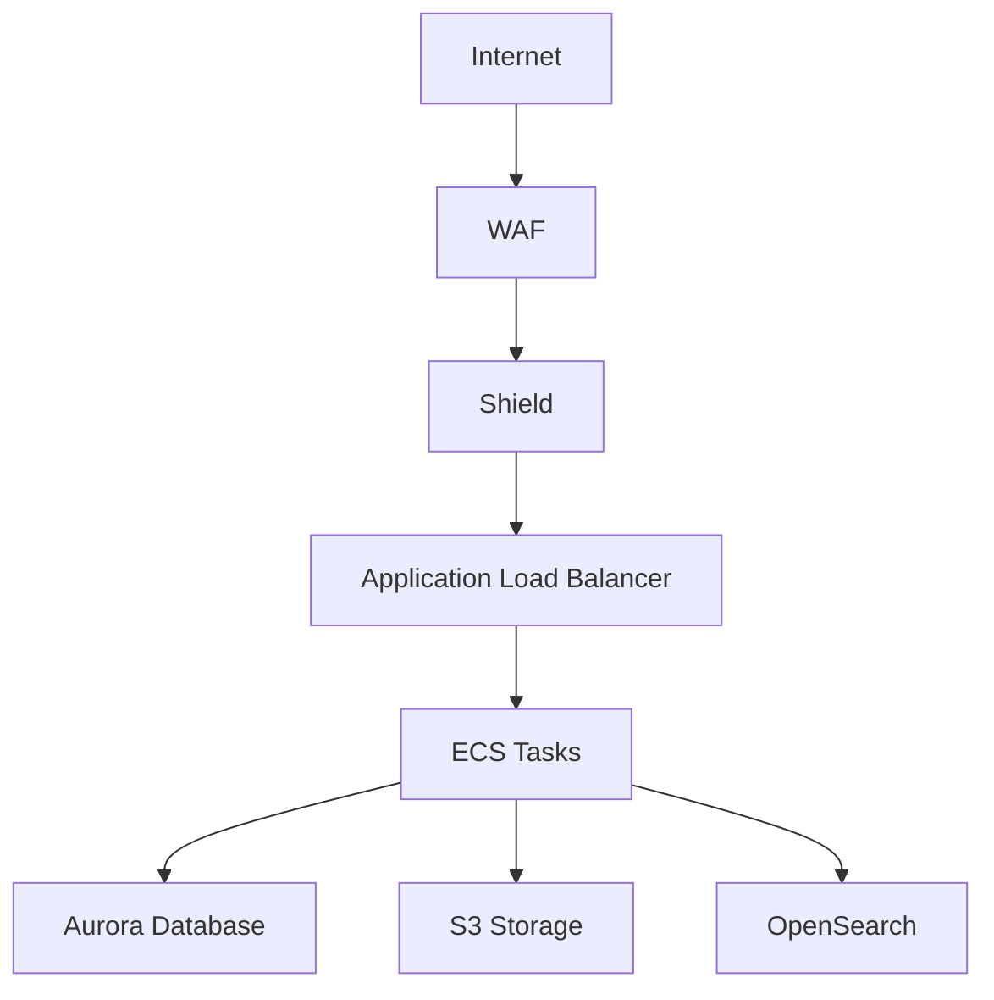

# Security Guide

## Table of Contents
1. [Overview](#overview)
2. [Security Architecture](#security-architecture)
3. [Security Best Practices](#security-best-practices)
4. [Security Configurations](#security-configurations)
5. [Security Operations](#security-operations)
6. [Incident Response](#incident-response)

## Overview

Our security architecture follows AWS Well-Architected Framework's security pillar and implements defense in depth with multiple security layers:

1. Network Security
   * VPC with public and private subnets
   * Security groups with least privilege access
   * WAF for web application protection
   * Shield Advanced for DDoS protection

2. Data Security
   * KMS encryption for data at rest
   * TLS encryption for data in transit
   * S3 bucket security with versioning and replication
   * Secrets management with automatic rotation

3. Identity and Access
   * IAM policies following least privilege
   * Resource-based policies with conditions
   * Code signing for Lambda functions
   * Multi-factor authentication

4. Monitoring and Audit
   * CloudWatch logs with encryption
   * CloudTrail for API auditing
   * GuardDuty for threat detection
   * OpenSearch for log analysis

## Security Architecture

### Network Security



1. VPC Configuration
   * Public subnets for ALB only
   * Private subnets for workloads
   * NAT Gateway for outbound traffic
   * VPC Flow Logs enabled

2. Security Groups
   * ALB: HTTPS inbound only
   * ECS: Traffic from ALB only
   * Aurora: Traffic from ECS only
   * OpenSearch: Internal traffic only

### Data Protection

1. Encryption at Rest
   * KMS keys with automatic rotation
   * S3 bucket encryption with KMS
   * RDS encryption with KMS
   * OpenSearch encryption with KMS

2. Encryption in Transit
   * TLS 1.3 for ALB listeners
   * VPC endpoints for AWS services
   * TLS for database connections
   * HTTPS for API endpoints

3. Data Lifecycle
   * S3 versioning enabled
   * Cross-region replication
   * Lifecycle policies
   * Backup retention policies

## Security Best Practices

### Infrastructure Security

1. S3 Bucket Security
   * Access logging enabled
   * Public access blocked
   * Versioning enabled
   * Cross-region replication
   * Event notifications
   * Lifecycle management

2. KMS and Secrets
   * Automatic key rotation
   * Secrets rotation
   * Key policies with conditions
   * Multi-region keys
   * Audit logging

3. IAM Policies
   * Resource-level permissions
   * Condition constraints
   * Least privilege access
   * Regular access reviews
   * Service control policies

4. Security Groups
   * Specific CIDR blocks
   * Service-linked rules
   * Proper descriptions
   * Regular reviews
   * Default deny

5. Lambda Security
   * VPC configuration
   * X-Ray tracing
   * Code signing
   * Concurrent limits
   * Environment encryption

### Application Security

1. Input Validation
   * API Gateway validation
   * WAF rules
   * Schema validation
   * Sanitization

2. Authentication
   * Multi-factor authentication
   * Token-based auth
   * Session management
   * JWT with rotation

3. Authorization
   * Role-based access
   * Resource policies
   * Context-based rules
   * Regular audits

## Security Configurations

### WAF Rules

```hcl
resource "aws_wafv2_web_acl" "app" {
  name        = "${local.name_prefix}-waf"
  description = "WAF for application protection"
  scope       = "REGIONAL"

  default_action {
    allow {}
  }

  rule {
    name     = "AWSManagedRulesCommonRuleSet"
    priority = 1
    override_action { none {} }
    statement {
      managed_rule_group_statement {
        name        = "AWSManagedRulesCommonRuleSet"
        vendor_name = "AWS"
      }
    }
    visibility_config {
      cloudwatch_metrics_enabled = true
      metric_name               = "CommonRuleMetric"
      sampled_requests_enabled  = true
    }
  }
}
```

### KMS Configuration

```hcl
resource "aws_kms_key" "app" {
  description             = "Application encryption key"
  deletion_window_in_days = 30
  enable_key_rotation     = true
  multi_region           = true

  policy = jsonencode({
    Version = "2012-10-17"
    Statement = [
      {
        Sid    = "Enable IAM User Permissions"
        Effect = "Allow"
        Principal = {
          AWS = "arn:aws:iam::${account_id}:root"
        }
        Action   = "kms:*"
        Resource = "*"
        Condition = {
          StringEquals = {
            "aws:PrincipalOrgID": "${org_id}"
          }
        }
      }
    ]
  })
}
```

### Security Group Rules

```hcl
resource "aws_security_group_rule" "alb_ingress" {
  type              = "ingress"
  from_port         = 443
  to_port           = 443
  protocol          = "tcp"
  cidr_blocks       = ["0.0.0.0/0"]
  description       = "HTTPS inbound"
  security_group_id = aws_security_group.alb.id
}

resource "aws_security_group_rule" "ecs_ingress" {
  type                     = "ingress"
  from_port                = 3000
  to_port                  = 3000
  protocol                 = "tcp"
  source_security_group_id = aws_security_group.alb.id
  description             = "Traffic from ALB"
  security_group_id       = aws_security_group.ecs.id
}
```

## Security Operations

### Monitoring

1. CloudWatch Metrics
   * Error rates
   * Request latency
   * Authentication failures
   * Authorization failures
   * WAF blocks

2. CloudWatch Logs
   * Application logs
   * Access logs
   * Audit logs
   * WAF logs
   * VPC Flow Logs

3. GuardDuty Findings
   * Unauthorized access
   * Suspicious activity
   * Data exfiltration
   * Cryptocurrency mining

### Alerting

1. High Priority
   * Security group changes
   * IAM policy changes
   * Root account usage
   * KMS key deletion
   * GuardDuty high severity

2. Medium Priority
   * Failed login attempts
   * WAF blocks
   * S3 public access
   * Unusual traffic patterns
   * API throttling

3. Low Priority
   * Configuration changes
   * Resource creation
   * Tag modifications
   * Cost anomalies

## Incident Response

### Response Procedures

1. Detection
   * Monitor alerts
   * Review logs
   * Analyze metrics
   * Check GuardDuty

2. Analysis
   * Identify scope
   * Determine impact
   * Review audit logs
   * Check configurations

3. Containment
   * Isolate resources
   * Block access
   * Rotate credentials
   * Update policies

4. Eradication
   * Remove threats
   * Update configurations
   * Apply patches
   * Verify removal

5. Recovery
   * Restore services
   * Verify functionality
   * Monitor closely
   * Document changes

6. Post-Incident
   * Review response
   * Update procedures
   * Improve detection
   * Train team

### Contact Information

1. Security Team
   * Slack: #security-team
   * Email: security@example.com
   * Phone: 1-800-xxx-xxxx
   * On-call: PagerDuty

2. AWS Support
   * Enterprise Support
   * Security Response
   * TAM Contact
   * Account Team

3. External Partners
   * SOC Provider
   * MSSP Contact
   * Forensics Team
   * Legal Team 