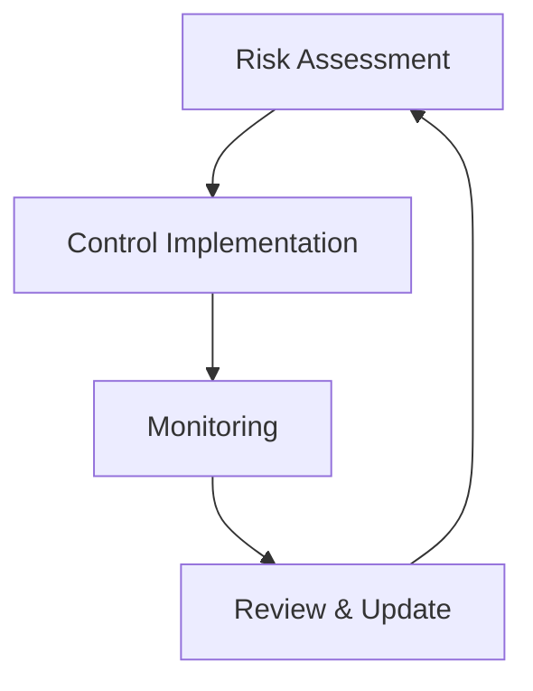

# Compliance & Standards

Gradiant maintains strict compliance with healthcare industry standards, with a primary focus on HIPAA compliance and data protection regulations.

## Compliance Framework

<CardGroup cols={2}>
  <Card title="HIPAA Compliance" icon="hospital" href="#hipaa-compliance">
    Healthcare data protection
  </Card>
  <Card
    title="Security Standards"
    icon="shield-check"
    href="#security-standards"
  >
    Industry certifications
  </Card>
  <Card title="Data Protection" icon="lock" href="#data-protection">
    Privacy regulations
  </Card>
  <Card title="Risk Management" icon="chart-network" href="#risk-management">
    Security controls
  </Card>
</CardGroup>

## HIPAA Compliance

### Core Requirements

<Warning>Strict adherence to healthcare data protection standards</Warning>

- Privacy Rule compliance
- Security Rule implementation
- Breach notification procedures
- Patient rights management
- Business Associate Agreements

### Implementation

<CodeGroup>
```typescript Audit Logging
import { HIPAALogger } from '@gradiant/compliance';

const logger = new HIPAALogger({
retentionPeriod: '6y',
encryptionEnabled: true,
backupEnabled: true
});

// Log access event
await logger.logAccess({
userId: 'user_123',
resourceType: 'patient_record',
actionType: 'view',
timestamp: new Date(),
reason: 'treatment'
});

````

```typescript Data Access
const accessControl = new HIPAAAccessControl({
  minimumNecessary: true,
  roleBasedAccess: true,
  auditEnabled: true
});

// Check access permission
const canAccess = await accessControl.checkAccess({
  userId: 'user_123',
  resourceId: 'record_456',
  action: 'view'
});
````

</CodeGroup>

## Security Standards

### Certifications

<Check>Comprehensive security certifications and compliance</Check>

| Standard      | Status    | Last Audit | Next Audit |
| ------------- | --------- | ---------- | ---------- |
| SOC 2 Type II | Certified | 2024-01    | 2024-07    |
| ISO 27001     | Certified | 2023-12    | 2024-12    |
| HITRUST       | Certified | 2024-02    | 2025-02    |
| NIST CSF      | Compliant | 2024-01    | 2024-07    |

### Framework Implementation

<AccordionGroup>
  <Accordion title="Access Control">
    - Role-based access control (RBAC) - Attribute-based access control (ABAC) -
    Principle of least privilege - Regular access reviews
  </Accordion>

{" "}

<Accordion title="Data Protection">
  - Encryption at rest - Encryption in transit - Data classification - Data
  retention policies
</Accordion>

  <Accordion title="Monitoring">
    - Real-time security monitoring - Intrusion detection - Audit logging -
    Anomaly detection
  </Accordion>
</AccordionGroup>

## Data Protection

### Privacy Regulations

<Info>Compliance with global privacy standards</Info>

- HIPAA (United States)
- GDPR (European Union)
- CCPA (California)
- PIPEDA (Canada)

### Implementation

```typescript
const privacyManager = new PrivacyManager({
  regulations: ["HIPAA", "GDPR", "CCPA"],
  dataRetention: {
    medical: "6y",
    audit: "6y",
    backups: "7y",
  },
  dataSubjectRights: {
    access: true,
    deletion: true,
    portability: true,
  },
});

// Handle data subject request
const response = await privacyManager.handleRequest({
  type: "access",
  subjectId: "user_123",
  scope: ["medical_records", "audit_logs"],
});
```

## Risk Management

### Security Controls



### Implementation

<CodeGroup>
```typescript Risk Assessment
const riskManager = new RiskManager({
  assessmentFrequency: 'quarterly',
  automatedScanning: true,
  vulnerabilityManagement: true
});

// Perform risk assessment
const assessment = await riskManager.performAssessment({
scope: ['infrastructure', 'applications', 'data'],
depth: 'comprehensive'
});

````

```typescript Control Monitoring
const controlMonitor = new SecurityControlMonitor({
  realTimeMonitoring: true,
  alertingEnabled: true,
  reportingFrequency: 'daily'
});

// Monitor control effectiveness
const status = await controlMonitor.checkControls({
  controlSet: 'encryption',
  metrics: ['effectiveness', 'coverage']
});
````

</CodeGroup>

## Audit Management

### Audit Process

<Note>Comprehensive audit trail for compliance verification</Note>

1. Event Collection
2. Secure Storage
3. Analysis
4. Reporting
5. Retention

### Implementation

```typescript
const auditManager = new AuditManager({
  storageProvider: "encrypted_s3",
  retentionPeriod: "6y",
  realTimeAnalysis: true,
});

// Record audit event
await auditManager.recordEvent({
  eventType: "data_access",
  userId: "user_123",
  resourceId: "record_456",
  action: "view",
  timestamp: new Date(),
  metadata: {
    ip: "192.168.1.1",
    userAgent: "Mozilla/5.0...",
    reason: "treatment",
  },
});

// Generate compliance report
const report = await auditManager.generateReport({
  period: "last_quarter",
  type: "hipaa_compliance",
  format: "pdf",
});
```

## Incident Response

### Response Protocol

<Warning>Structured approach to security incidents</Warning>

<Steps>
  ### Detection Identify and classify the incident ### Containment Limit the
  impact and spread ### Eradication Remove the threat ### Recovery Restore
  normal operations ### Lessons Learned Document and improve
</Steps>

### Implementation

```typescript
const incidentManager = new IncidentManager({
  notificationChannels: ["email", "slack", "sms"],
  automatedResponse: true,
  forensicsEnabled: true,
});

// Handle security incident
await incidentManager.handleIncident({
  type: "unauthorized_access",
  severity: "high",
  affectedSystems: ["auth_service"],
  timestamp: new Date(),
});
```

## Best Practices

<CardGroup cols={2}>
  <Card title="Regular Audits" icon="clipboard-check">
    Conduct periodic assessments
  </Card>
  <Card title="Documentation" icon="file-lines">
    Maintain compliance records
  </Card>
  <Card title="Training" icon="graduation-cap">
    Staff security awareness
  </Card>
  <Card title="Updates" icon="rotate">
    Keep policies current
  </Card>
</CardGroup>

## Support

Need help with compliance? Contact our compliance team:

<CardGroup cols={2}>
  <Card
    title="Compliance Support"
    icon="balance-scale"
    href="mailto:compliance@gradiant.dev"
  >
    Contact compliance team
  </Card>
  <Card title="Documentation" icon="book" href="/compliance/docs">
    View compliance guides
  </Card>
</CardGroup>
